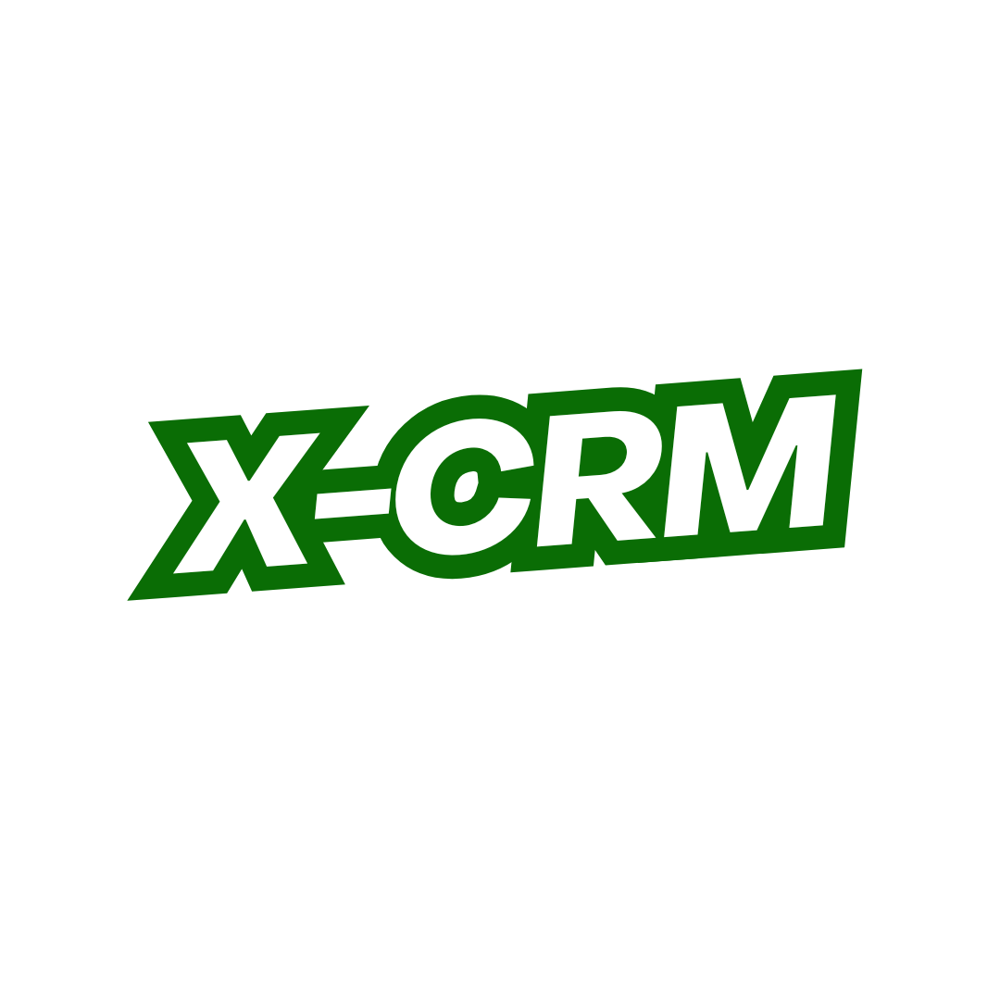

# Tentang X - CRM

### X-CRM adalah program **Customer Relationship Management** sederhana yang dapat digunakan untuk manajemen pelanggan secara efisien. Beberapa fitur utama yang disediakan:

- Upload data CSV ke dalam database.
- Operasi CRUD (Create, Read, Update, Delete) pada data pelanggan.

### Fitur Utama

- **Upload CSV**: Pengguna dapat mengimpor data pelanggan langsung ke dalam sistem dari file CSV.
- **Operasi CRUD**: Sistem mendukung operasi dasar untuk menambah, melihat, memperbarui, dan menghapus data pelanggan.

---

## Cara Mengunduh Proyek

### 1. Mengunduh Langsung (ZIP)

- Klik tombol **<> Code** pada halaman repository.
- Pilih opsi **Download ZIP**.
- Ekstrak file yang sudah diunduh dan buka di text editor pilihanmu.

### 2. Mengunduh Melalui Version Control (Git)

1. Buka **Command Line** (atau Git Bash jika menggunakan Windows).
2. Pastikan Git sudah terinstal dengan benar.
3. Jalankan perintah berikut untuk meng-clone repository:  <br>
   ```bash
   gh clone https://github.com/cahyahabib00/x-crm.git
4. Masuk ke direktori proyek:
   ```bash
   cd x-crm
5. Buka proyek dengan text editor pilihanmu. Jika kamu menggunakan VS Code, jalankan perintah:
   ```bash
   code .
6. Instal Dependency dengan Composer
   ```bash
   composer install
7. Konfigurasi file **.env**
8. Generate API Key
    ```bash
    php artisan key:generate
9. Migrasi Database
    ```bash
    php artisan migrate
10. Jalankan Server Laravel
    ```bash
    php artisan serve  
### 3. Mengunduh Sempel CSV 
Download Sample CSV yang Bisa Kamu Pakai didalam X-CRM <a href="{{ asset('./public/sample.csv') }}" download="myfile.csv">Download CSV</a>
